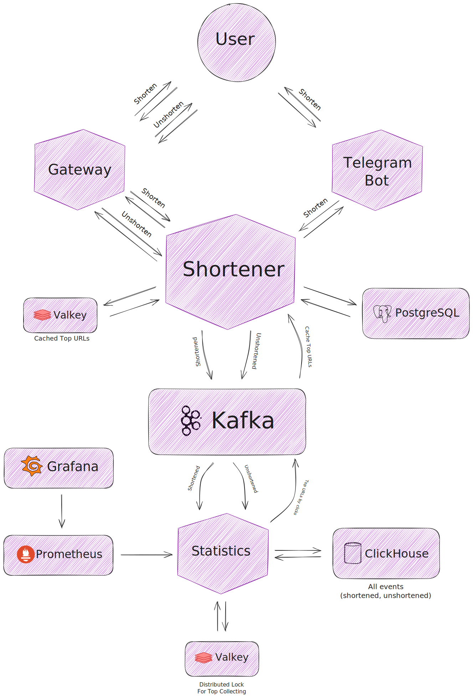

# URL Shortener

A service that shortens URLs.
My first practice with gRPC & microservices in event-driven system with distributed tracing.

## Architecture

### Diagram

<p>
    
</p>

### Main service (shortener), gRPC

To shorten URL, this service stores original URL in PostgreSQL and encodes ID into base62.

To unshorten URL, it tries to get original URL by code from cache (Valkey). If not in cache, it decodes base62 and queries the PostgreSQL.

It is a Kafka producer for topics `shortener.shortened` and `shortener.unshortened`.

It is a Kafka consumer for topic `shortened.top_unshortened`.

##### Caching

This service gets a top of URLs by clicks for the last time (configured in .env) from Kafka and stores these URLs in Valkey with configured TTL.

### Gateway, REST

This service communicates with the `shortener` by gRPC.

To shorten URL, it gets base62 encoded id from `shortener` and constructs final URL using `PUBLIC_HOST` and base62. For example, base62 is `1z`, PUBLIC_HOST is `https://sh.some/`. Final URL is `https://sh.some/1z`.

To unshorten URL, it queries the `shortener` and gets original URL by base62 in the path param in the request. Then, it redirects with 302 to the original URL.

### Bot, Telegram inline mode

This service also communicates with the `shortener` by gRPC.

Bot only shortens the URL, unshortening process is on `gateway`.

Shortening process is the same as the one in `gateway`: walk to the `shortener`, get base62, connect public host.

It takes the URL in inline mode. For example, `@mybot https://github.com/misshanya/url-shortener`. And you will get the shortened URL.

### Statistics

This service is a Kafka consumer for 2 topics: `shortener.shortened` and `shortener.unshortened`.

It gets events, logs them, stores in `ClickHouse` and increments `Prometheus` counters.

`Statistics` service has a background goroutine to get top of the URLs by clicks from ClickHouse for the last time.
It sends this top to `Kafka`.

This strategy helps to [cache URLs](#caching) in the `shortener` service.

## Tech stack

- Go
- PostgreSQL
- Valkey (Cache)
- ClickHouse
- Kafka (UI is available on port 8088)
- Prometheus
- Grafana (available on port 8089)

## How to

### Prerequisites

- Docker
- Go 1.24+ (if you want to build without Docker)
- Telegram bot token

### Run

Clone repo and `cd` into it

```shell
git clone https://github.com/misshanya/url-shortener
cd url-shortener
```

Copy .env.example to the .env file and edit it with your preferences (like public url and bot token)

```shell
cp .env.example .env
```

Run!

```shell
docker compose up -d
```

### Gateway's usage

**Shorten** - `POST /shorten` with the following body:

 ```json
 {
   "url": "your-url-to-shorten"
 }
 ```

**Unshorten** - `GET /{base62}`

## License

This project is licensed under the MIT license. See the [LICENSE](./LICENSE) file for details.
